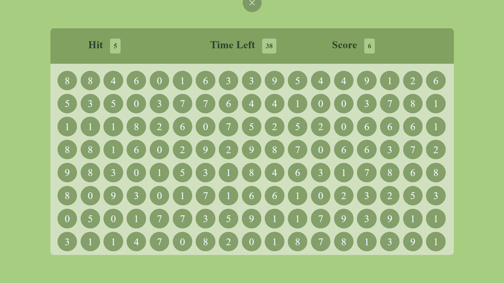

# Bubble-Game 🫧

A simple and fun bubble clicking game built using HTML, CSS, and JavaScript. The player has 60 seconds to hit the correct bubble as many times as possible!

---

## 🕹️ How to Play

- The game randomly displays a **target number**.
- Click on any bubble that **matches the target number**.
- For every correct click:
  - Your **score** increases by 2.
  - The **bubbles regenerate** with new random numbers.
  - A **new target** is assigned.
- The timer counts down from 60 seconds.
- When time's up, the game ends and bubbles disappear.

---

## 📂 File Structure

Bubble-Game/<br>
│<br>
├── body.html # Main HTML file (game layout)<br>
├── style.css # Styling for game layout and bubbles<br>
├── script.js # Game logic: timer, scoring, bubble generation<br>
└── README.md # Game overview and instructions<br>

---

## 💻 Technologies Used

- **HTML5** – Structure
- **CSS3** – Styling and layout
- **JavaScript (Vanilla)** – Game logic and interactivity

---

## 📸 Screenshot
<p align="center">
  
</p>


---

## 🚀 Getting Started

To play locally:

1. Clone or download the repo.
2. Open `body.html` in any modern web browser.

```bash
git clone https://github.com/your-username/bubble-game.git
cd bubble-game
```
Have fun hitting the bubbles!
